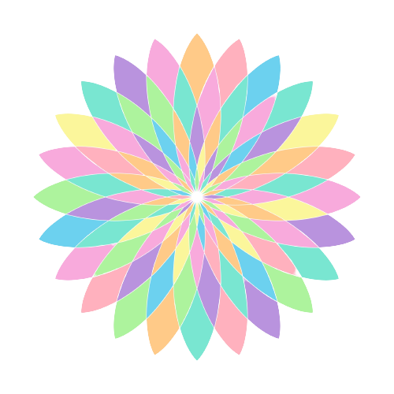
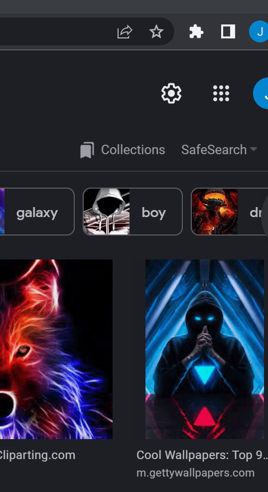

  
  <h3 align="center">Clarify</h3>
  

    A Chrome Extension for Color Blind Users
  

  
Table of Contents

  <ol>
    <li>
      <a href="#about-the-project">About The Project</a>
      <ul>
        <li><a href="#built-with">Built With</a></li>
      </ul>
    </li>
    <li><a href="#usage">Usage</a></li>
    <li><a href="#license">License</a></li>
    <li><a href="#sources">Sources</a></li>
  </ol>

## About the Project

Our aim is to make the web more accessible for all users. The extension performs a process known as Daltonization to help those with color vision deficiencies to be able to distinguish a range of detail they are typically not able to perceive.

### Built With:
* JavaScript
* CSS
* HTML

## Usage
<!-- { width=50% } -->

<!-- { width=50% } -->

## Sources
* Create a Google Chrome Extension (For Beginners): [https://youtu.be/uV4L-wcnK3Y](https://youtu.be/uV4L-wcnK3Y)
* SVG: Scalable Vector Graphics: [https://developer.mozilla.org/en-US/docs/Web/SVG/Element/feColorMatrix](https://developer.mozilla.org/en-US/docs/Web/SVG/Element/feColorMatrix)
* Convert Images To Black And White With CSS: [http://thenewcode.com/532/Convert-Images-To-Black-And-White-With-CSS](http://thenewcode.com/532/Convert-Images-To-Black-And-White-With-CSS)
* Color Accessibility on Digital Displays: [http://www.daltonize.org/p/about.html](http://www.daltonize.org/p/about.html)
* Colorblind Filters: [https://gitlab.com/skingrapher/colorblind-filters/-/blob/master/colorblind-filters.svg](https://gitlab.com/skingrapher/colorblind-filters/-/blob/master/colorblind-filters.svg)
* Fresh-eyes: [https://github.com/fresh-eyes/fresh-eyes](https://github.com/fresh-eyes/fresh-eyes)

### Images
* Shutterstock: [https://www.shutterstock.com/](https://www.shutterstock.com/)

## License
Distributed under the MIT License. See `LICENSE` for more information.
