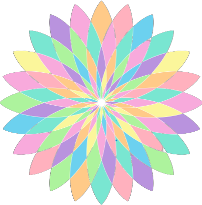

  
  <h3 align="center">Clarify</h3>
  

    A Chrome Extension for Color Blind Users
  

  
Table of Contents

  <ol>
    <li>
      <a href="#about-the-project">About The Project</a>
      <ul>
        <li><a href="#built-with">Built With</a></li>
      </ul>
    </li>
    <li><a href="#usage">Usage</a></li>
    <li><a href="#license">License</a></li>
    <li><a href="#sources">Sources</a></li>
  </ol>

## About the Project

Our aim is to make the web more accessible for all users.

### Built With:
* JavaScript
* CSS
* HTML

## Usage

## Sources
* Create a Google Chrome Extension (For Beginners): [https://youtu.be/uV4L-wcnK3Y](https://youtu.be/uV4L-wcnK3Y)
* Fresh-eyes: [https://github.com/fresh-eyes/fresh-eyes](https://github.com/fresh-eyes/fresh-eyes)

### Images
* Shutterstock: [https://www.shutterstock.com/](https://www.shutterstock.com/)

## License
Distributed under the MIT License. See `LICENSE` for more information.

## Contributors:
* Riju Abraham
* Jason Bernal
* Justin Lee
* Connor Murphy